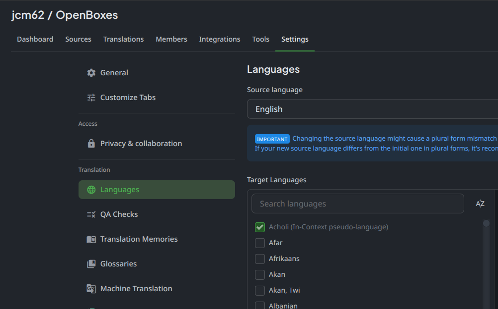
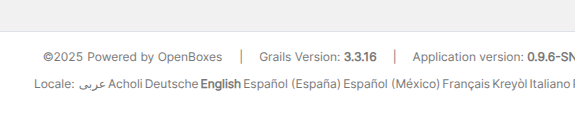

# Administer Crowdin

These instructions are for project administrators. If you're a community translator who wants a new language added, see [Adding a New Language](../contribute-without-code/translations/adding-new-languages.md) instead.

## Adding a language to Crowdin

Translated languages in Crowdin are known as "target languages". To add a new target language, navigate to the project settings > Languages, then select any new languages that we want to support.

<figure><figcaption></figcaption></figure>

This should cause Crowdin to automatically create a pull request into the openboxes repository containing a new `messages.properties` file for the language.

See [Crowdin's documentation](https://support.crowdin.com/project-settings/languages/#target-languages) for additional information.

The following video covers everything required to configure Crowdin (plus also explains how the In-Context feature works):



## Adding a language to OpenBoxes

Edit the `application.yml` file and add the [two letter locale code](https://simplelocalize.io/data/locales/) of the new language to the `supportedLocales` property:

```
openboxes:
    locale:
        supportedLocales: [...]
```

After redeploying the application, the new language should be selectable in the list of locales in the website footer.

<figure><figcaption></figcaption></figure>
