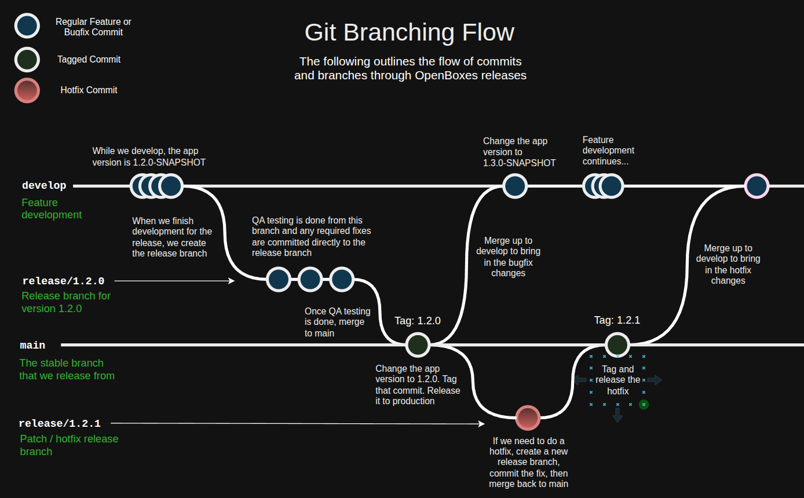

# Repositories and Branches

## Repositories

| Repository | What's in it |
| ---------- | ------------ |
| [openboxes/openboxes](https://github.com/openboxes/openboxes) | The application itself — Grails backend, React frontend, database migrations, and the user and administrator documentation published to [docs.openboxes.com](https://docs.openboxes.com). |
| [openboxes/openboxes-mobile](https://github.com/openboxes/openboxes-mobile) | The React Native mobile app for iOS and Android. See [Mobile App](../contribute-code/mobile-app.md). |
| [openboxes/openboxes-e2e](https://github.com/openboxes/openboxes-e2e) | The Playwright end-to-end test suite, which runs against a deployed environment. See [End-to-End Tests](../contribute-code/end-to-end-tests.md). |
| [openboxes/openboxes-docs](https://github.com/openboxes/openboxes-docs) | This contributor guide. See [Improve These Docs](../contribute-without-code/improve-these-docs.md). |

The branch model and versioning below describe the main `openboxes` repository. The other repositories follow their own conventions — check their recent history.

## Branches in the main repository

<figure><figcaption></figcaption></figure>

* **`develop`** is where day-to-day development happens. It has all of our latest changes, and is therefore not stable enough to release from. **Branch your work off `develop` and open your pull request back into it.**
* **`main`** is our stable branch. It only ever receives merges from a release branch, and each of those merges is tagged as a release.
* **`release/x.y.z`** branches are cut from `develop` when feature work for a release is done. The release candidate is tested on this branch, bug fixes go directly into it, and then it is merged into `main`. We keep old release branches around for transparency and so that we can patch an old release if we ever need to.

Because release branches are cut early, `develop` never has to be frozen — regular development continues in parallel while a release is being tested.

For the full procedure, see [Cut a Release](../for-maintainers/cut-a-release.md).

## Versioning

Our releases follow the [Semantic Versioning (semver) pattern](https://semver.org/). Given a version number MAJOR.MINOR.PATCH, we increment the:

1. MAJOR version when we make incompatible API changes
2. MINOR version when we add functionality in a backward compatible manner
3. PATCH version when we make backward compatible bug fixes

Version numbers carry a suffix that tells you what stage a build is at: `x.y.z-SNAPSHOT` is unreleased development, `x.y.z-RC` is a release candidate under test, and a bare `x.y.z` is a released version.
