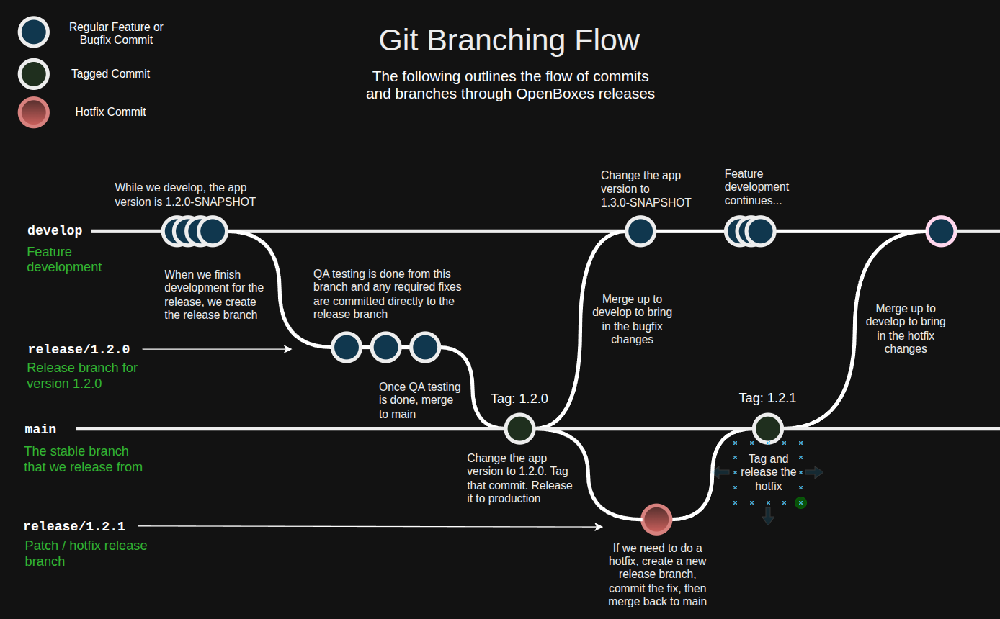
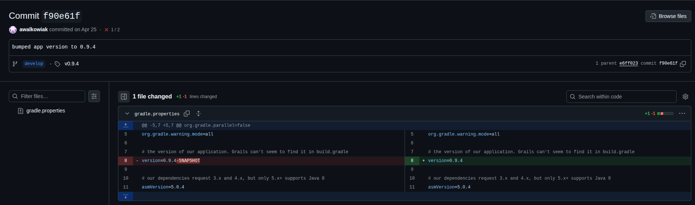

# Creating A New Release

The following outlines the steps required in order to create a new release of OpenBoxes.

It is the responsibility of the release manager to not only perform the release, but to determine if the application is in a stable enough state for us to be deemed as "release-ready".

<figure><figcaption></figcaption></figure>

### 1. Create a new release branch off of 'main'

#### 1a. Creating the branch

We do our development work in the 'develop' branch. This branch has all of our latest changes, and so is not stable to release from. Once we've completed all feature development for the release, the release process can be started by creating a new branch for the release. This branch is known as the "Release Candidate".

Creating the release branch at this point saves us from needing to "freeze" the develop branch. Since we have already cut a branch containing the release candidate, regular development can continue in parallel.

The release branch should be named: `release/<release_version>`  where `release_version` is the semver number of the upcoming release.

For example, if the application is being bumped to `v0.9.8`, the branch should be named `release/0.9.8`

Our releases follow the [Semantic Versioning (semver) pattern](https://semver.org/). In short:

> Given a version number MAJOR.MINOR.PATCH, increment the:
>
> 1. MAJOR version when you make incompatible API changes
> 2. MINOR version when you add functionality in a backward compatible manner
> 3. PATCH version when you make backward compatible bug fixes

For example, if we're currently on v1.4.3 and need to create a new release:

* if we're only making a bug fix -> v1.4.4
* if we're adding new functionality -> v1.5.0
* if we're making a backwards incompatible change -> v2.0.0

#### 1b. Bumping the application version (optional)

As a part of the merge, change the version number in the `gradle.properties` file:

```
version=x.y.z-RC
```

Where `x.y.z` is the new version. Often the version number will already be correct, but make sure to change `-SNAPSHOT` to `-RC` (release candidate).

This step is optional, but we do it so that we can very easily distinguish between released versions (`x.y.z`), release candidates (`x.y.z-RC`), and development versions (`x.y.z-SNAPSHOT`)

The commit message for this change should be `"create release candidate x.y.z"` (where `x.y.z` is the new version).


### 2. Test the release


Release testing is currently being conducted by PIH + SolDevelo staff. Testing is done on a dedicated staging environment.


After creating the release branch, we typically give ourselves a one week "Regression Sprint". This sprint acts as a buffer period as it allows us to test the release candidate to confirm its stability.

If testing unconvers any bugs, we submit the bugfix directly to the release branch.


### 3. Merge the release branch into 'main'

Now that our release candidate is through testing, we merge it into the 'main' branch (which is our stable branch).

#### 3a. Merge the release branch into main

```
git switch release/x.y.z
git pull
git switch main
git pull
git merge release/x.y.z
git push origin main
```

This will perform a fast-forward merge if there are no conflicts, which will update main to include the commit history of the release branch without a merge commit. Otherwise if there are conflicts, it will require them to be resolved and a merge commit will be created.

Resolve all the merge conflicts. (You can do this [directly in Intellij](https://www.jetbrains.com/help/idea/resolve-conflicts.html) if you like.) Then run:

```
git commit    (hit ctrl + x to save the commit with the default message)
git push origin main
```

#### 3a. Bump the application version

In a new commit on main, remove `-RC` (or `-SNAPSHOT` if step 1b was not performed) from the end of the version number in the `gradle.properties` file:

```
version=x.y.z
```

The commit message for this change should be `"bumped app version to x.y.z"` (where `x.y.z` is the new version).

With this commit, the "release candidate" becomes a proper release.

At this point we \*could\* delete the release branch, but we've opted to keep them around for the sake of transparency, and so that we can easily patch fix old releases if we ever needed to.


### 4. Tag the release commit

We need to tag the commit from step 3b so that we can create the actual release from it. First, find the commit number.

<figure><figcaption></figcaption></figure>

First, make sure you have the version bumping commit locally (which you might not if you did step 3b via editing the file directly in GitHub):

```
git switch main
git pull
```

Then create the tag and push it to the repository:

```console
git tag -a v<release_version> <commit_hash> -m 'Release <release_version>'
git push --tags
```

Where `<release_version>` is the semver of the release, and `<commit_hash>` is the unique id of the commit that you want to tag. For example, using the above image:

```
git tag -a v0.9.4 f90e61f -m 'Release 0.9.4'
```


### 5. Update the release notes

Once you complete step 4 and push the new tag, [a GitHub Action that we created](https://github.com/openboxes/openboxes/actions/workflows/do-github-release.yml) will be triggered, automatically creating [the GitHub release](https://github.com/openboxes/openboxes/releases) for you.

The generated release notes will be populated with a "What's Changed" section, hilighting all the commits from the release. It will also automatically contain an openboxes.war file containing the application distribution for the release.

All you should need to do is confirm everything looks as expected and add any additional notes that are required for the release. If the release contains backwards incompatible changes, these should be pointed out clearly in the release notes and be paired with instructions on how to upgrade to the new version.


### 6. Merge back up to develop

Now that the release is completed, we need to merge main back up to develop so that the develop is up to date with any new commits from main.

#### 6a. Merge main into the develop branch

```
git switch main
git pull
git switch develop
git pull
git merge main
git push origin develop
```

This will perform a fast-forward merge if there are no conflicts, which will update develop to include the commit history of main without a merge commit. Otherwise if there are conflicts, it will require them to be resolved and a merge commit will be created.

Resolve all the merge conflicts. (You can do this [directly in Intellij](https://www.jetbrains.com/help/idea/resolve-conflicts.html) if you like.) Then run:

```
git commit    (hit ctrl + x to save the commit with the default message)
git push origin develop
```

#### 6b. Bump the application version

As a part of the merge, bump the patch version in the `gradle.properties` file, adding SNAPSHOT to the end (signifying this new version is unreleased):

```
version=x.y.z-SNAPSHOT
```

For example, if the version was `1.2.3`, it should now be `1.2.4-SNAPSHOT` .

_(As a side note, we should probably be bumping the minor version instead of the patch version, but we can re-evaluate our approach later.)_


### 7. Publishing to the community

Create a new announcement post on [the community forums](https://community.openboxes.com/c/announcements/12) so that we can announce the release to the wider community!

Make sure to clearly point out any backwards incompatible changes so that the community is aware of them, and if possible add instructions (or link to instructions) on what users need to do to upgrade to the new version.

Go back to the release notes from step 5 and edit the notes, adding a link to the community release post that you just created.
