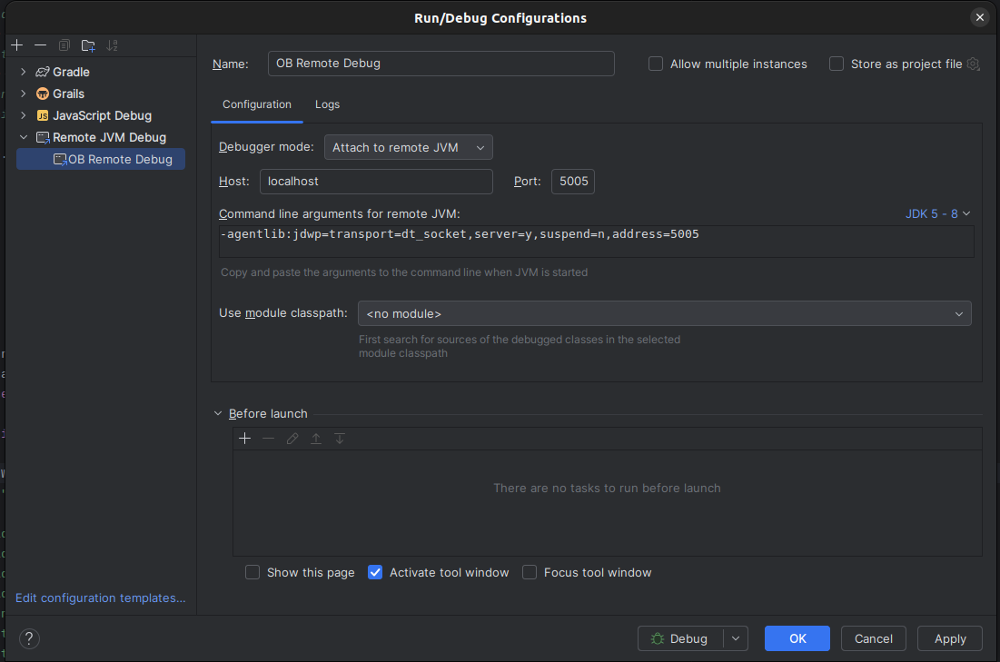
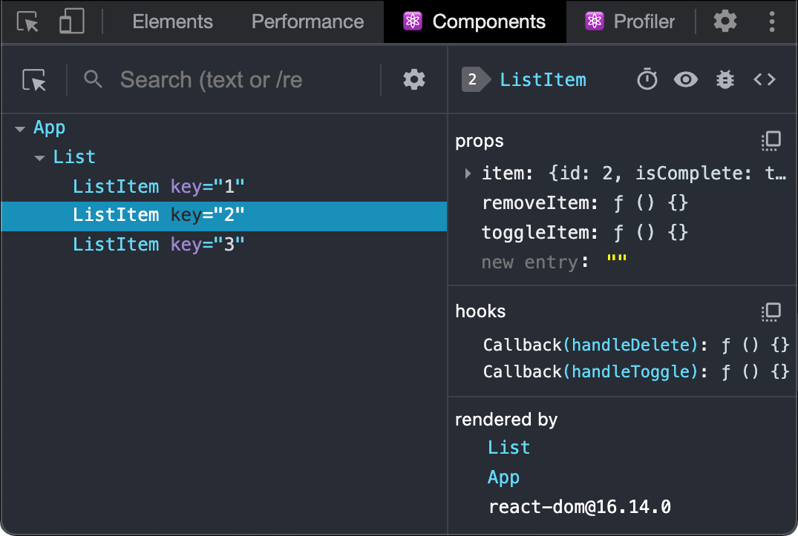
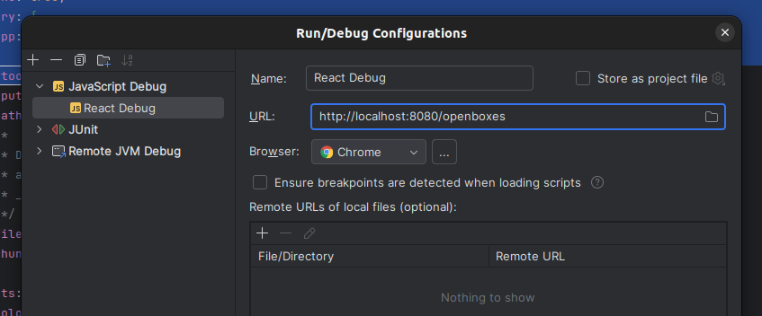

# Local Debugging

### Debugging the backend

Make sure that your application Run Grails normally:

```
grails run-app
```

Then in Intellij navigate to Run > Edit Configurations and create a new Remote Debug Configuration:

* **Debugger mode:** Attach to remove JVM
* **Host:** localhost
* **Port:** 5005
* Command line arguments:&#x20;
  * ```
    -agentlib:jdwp=transport=dt_socket,server=y,suspend=n,address=5005
    ```

<figure><figcaption></figcaption></figure>

From there you should be able to run the remote debugger and have it trigger breakpoints in groovy and GSP files.


### Debugging the frontend

#### Unpacking Webpack <a href="#unpacking-webpack" id="unpacking-webpack"></a>

We use Webpack to pack all our javascript files together to compress them and make them easier to serve. This makes debugging significantly harder but fortunately you can force webpack to maintain a source map alongside the bundled files so that you can still fully debug through the original source files.

Locate the 'devtool' property in `webpack.config.js` and change it to the following:

```
module.exports = {
    ...
    devtool: 'inline-source-map',
    ...
}
```

Then restart your frontend.


#### React Developer Tools

[This browser plugin](https://react.dev/learn/react-developer-tools) allows you to easily view the state of the React components on a webpage.

<figure><figcaption></figcaption></figure>


#### Debugging with Intellij

If you want to debug directly via Intellij, navigate to Run > Edit Configurations and create a new JavaScript Debug Configuration:

* **URL:** http://localhost:8080/openboxes
* **Browser:** Chrome

<figure><figcaption></figcaption></figure>

Start your server normally then start this run config. It will launch a new browser window that you can use to navigate through OpenBoxes and it will trigger any breakpoints you have set up in your IDE.


#### Debugging with your browser

You can debug the frontend directly via the browser. Just make sure to unpack Webpack first as outlined above.

In Chrome:

* Right click >
* Inspect >
* navigate to the Sources tab >
* Navigate to the source file you want >
* click in the line number column to add a breakpoint on the line you want

And as a bonus, if you’re using the browser that launches via the above Intellij run config, any breakpoints you add in the browser will also trigger in your IDE and you can debug them there isntead if you prefer.

