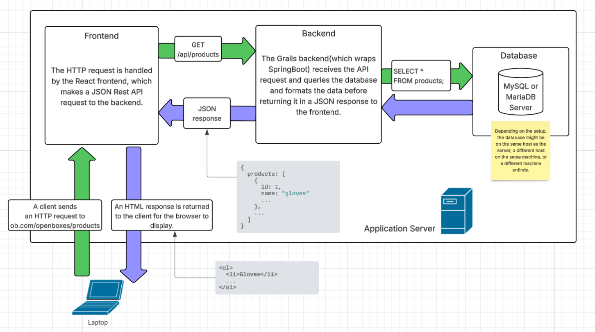
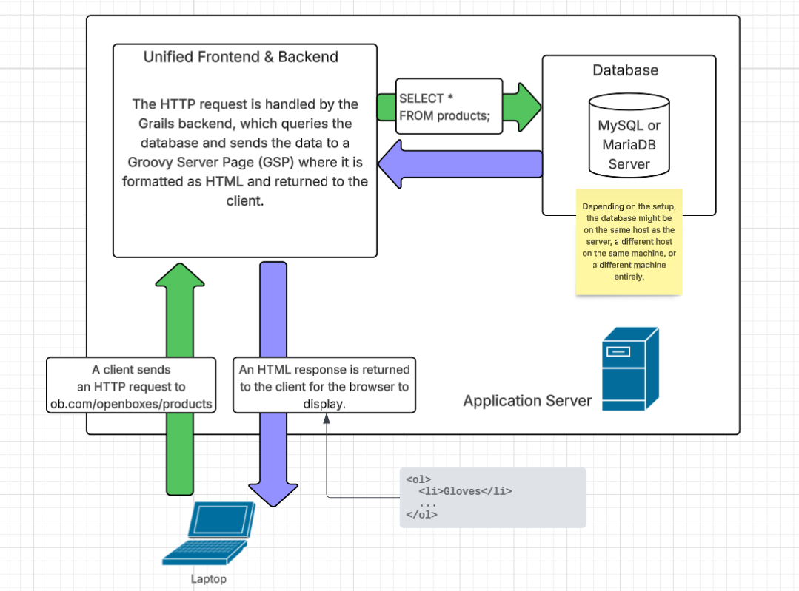

# Example Request Flow

The following is a sample request flow through the OpenBoxes application:

<figure><figcaption></figcaption></figure>

More specifically, HTTP requests (such as `https://my-app.com/openboxes/products`) are routed by the React frontend in `Router.jsx` and  `applicationUrls.js` to jsx files that are responsible for generating the HTML of the page (via use of React Components). Within those files, Restful API calls (such as `GET /api/products`) are sent to the backend to fetch the required data that will later be used to fill the HTML content. `UrlMappings.groovy` handles request routing on the backend, with a `XApiController.groovy` file being the starting point for the request. The Controller then invokes an `XService.groovy` class which contains the bulk of the logic for processing the request, including querying the database via GORM requests (ex: `Product.list()`). The backend then serializes the data as JSON and returns it in the API response to the frontend. The React frontend uses that JSON response to build the HTML content for the page, which gets returned back down to the user in the HTTP response.

It's important to note that we didn't always have the React frontend. Some of the older features in the app are using a different approach. For these older features, requests are processed by `XController.groovy` classes (instead of `XApiController.groovy`) and the frontend HTML data is generated by Groovy Server Pages (.gsp files).

The flow for our old features looks like the following:

<figure><figcaption></figcaption></figure>
