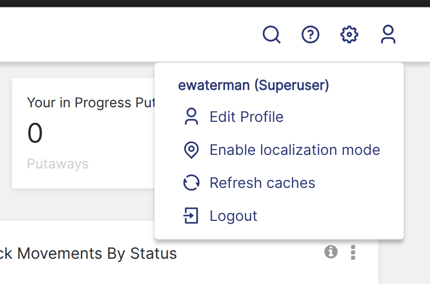

# Creating New Translations

There are instances of OpenBoxes running all over the world, but there are many languages that we're missing essential localization for. If you speak another language, we'd greatly appreciate your help in translating the app!

If you would like to contribute translations for a language that does not yet exist in OpenBoxes, take a look through [our instructions for adding new languages](https://app.gitbook.com/o/-LytULTRVvZHXduWJrqI/s/3VCsGCdilEku76VKkKJk/~/changes/2/adding-new-languages).

If the language does exist, we have a few methods for adding new translations:

## Translate via Crowdin

[Crowdin](https://crowdin.com/) is a localization tool that makes it easy to contribute translations to the application without needing to touch a line of code. Crowdin is our preferred way for community members to provide translations.

To contribute new translations via Crowdin, please [register for a Crowdin account](https://support.crowdin.com/for-translators/#create-an-account) and then [request access to the OpenBoxes Crowdin project](https://crowdin.com/project/openboxes). Once you have access to the project you'll be able to add new translations to the application via the Crowdin web editor.

From the Crowdin dashboard page, simply click on the language that you want to translate:

<figure><figcaption></figcaption></figure>

Then click on the green "Translate All" button:

<figure><figcaption></figcaption></figure>

And then you can start adding and saving your translations:

<figure><figcaption></figcaption></figure>

For more detailed instructions, you can take a look at [Crowdin's documentation](https://support.crowdin.com/for-translators/#working-in-the-editor).

## Translate via in-app translations

Crowdin provides a feature called "In-Context Localization", which allows you to add translations while working directly in the OpenBoxes application.

This feature is great for when you need to understand the context in which a certain piece of text exists in the app, or for when you happen to notice a missing or incorrect translation while working within the app. It is less useful if you're trying to do bulk translations because you need to be able to navigate to the specific page that has the fields you're trying to translate.

To enter in-app translations mode, click on the profile icon in the top right corner of the app, then click on "Enable localization mode":

<figure><figcaption></figcaption></figure>

This will put you in localization mode where you'll be able to click on the individual fields that you want to localize and provide in-place translations.

<figure><figcaption></figcaption></figure>

Make sure to press "save" to persist the translation to Crowdin.

You can exit localization mode via the big button in the top right corner.

Note that once you exit translation mode, the translations that you made will not immediately be visible in the application. This is because translations need to go through an approval process before they are merged into the application. [See the below FAQ section](./#i-added-new-community-translations-why-dont-i-see-them-in-openboxes-yet) for a more detailed explanation as to why.&#x20;

If you don't see the "Enable localization mode" button, it is likely because in-app translations are disabled for that environment. Currently there is no community environment set up to support in-app translations (it is only enabled on PIH-internal environments).

## Translate directly in message.properties files

If for whatever reason you're unable to use Crowdin, you can still contribute translations directly into the code base. However if Crowdin is an option for you, we request that you contrbute that way since it is our preferred apprach (it avoids synchronization issues and issues with special characters).

Our translations are stored in [message.properties files](https://github.com/openboxes/openboxes/blob/develop/grails-app/i18n/messages.properties). You can make pull requests containing your translations directly to those files.

Note that unless you have push access to the openboxes repository, you'll need to first [fork the OpenBoxes repository](https://docs.github.com/en/pull-requests/collaborating-with-pull-requests/working-with-forks/fork-a-repo) and then [create a pull request from your fork back into the main OpenBoxes repository](https://docs.github.com/en/pull-requests/collaborating-with-pull-requests/proposing-changes-to-your-work-with-pull-requests/creating-a-pull-request-from-a-fork).

## FAQ

### I added new community translations, why don't I see them in OpenBoxes yet?

Translations need to go through an approval process before they are merged into the application.

Whenever a translation is made, Crowdin will create a pull request ([like this one](https://github.com/openboxes/openboxes/pull/5422)) containing the translation into the openboxes repository. This pull request must be approved and merged before the translations can take effect.

But just because a translation has been merged, doesn't mean you'll see it immediately on your production environment. Translations are bundled with the application, and so merged in translations will only be visible in OpenBoxes in the subsequent release.

Merged translations will be visible immediately in any local development environments that are built from the 'develop' branch.
