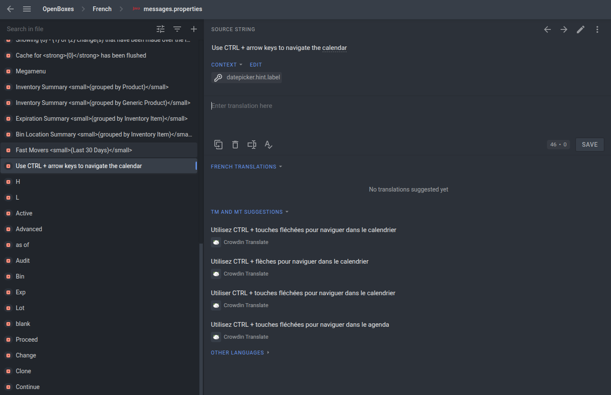

# Creating New Translations

There are instances of OpenBoxes running all over the world, but there are many languages that we're missing essential localization for. If you speak another language, we'd greatly appreciate your help in translating the app!

We use [Crowdin](https://crowdin.com/) for handling all of our translations. If you're interested in contributing new translations, please [join our Crowdin project](https://crowdin.com/project/openboxes) and [follow Crowdin's instructions on how to add new translations](https://support.crowdin.com/for-translators/).

<figure><figcaption></figcaption></figure>

