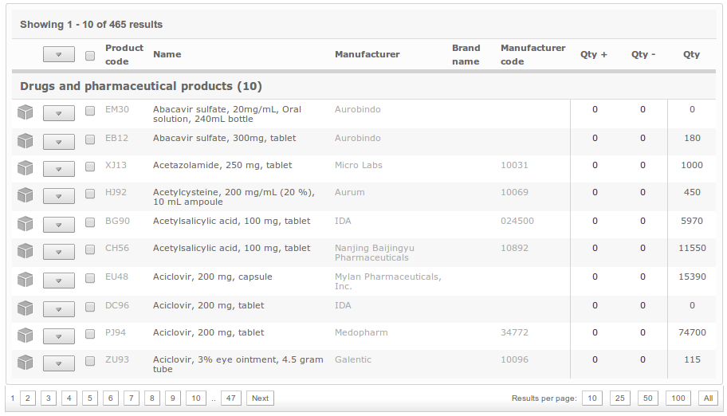

OpenBoxes
=========
OpenBoxes is an open-source supply chain management system designed to
manage supplies and medications for healthcare facilities and disaster
response operations.

.. toctree::
   :maxdepth: 1
   :caption: Overview

   getting-started
   features
   benefits
   considerations 
   support
   release-notes

.. toctree::
   :maxdepth: 1
   :caption: Installation Guide

   installation/index

.. toctree:: 
   :maxdepth: 1
   :caption: Configuration
    
   configuration

.. toctree::
   :maxdepth: 1
   :caption: User Guide
   
   user-guide/index

.. toctree::
   :maxdepth: 1
   :caption: Developer Guide
   
   developer-guide/index

